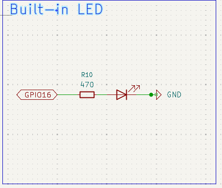

# DevBoard202
This is a dev board that runs with the RP2040 but structured more simple than Pi Pico. The schematic is inspired by the document "Hardware design with RP2040", the PCB is made with the tutorial from @KaiPereira.
The reason I do this project is to understand more about how capacitors, resistors are used with components like MCU, oscillator, USB ports. Moreover, design a development board provide more control over how  I can use the MCU, in which I remove some functionalities from the Pi Pico to make this board simple and easier to use. 

Using instruction:
Using this development board is similar to any other development board. We can just plug wires to GPIO pins to use. The usage of GPIO pins can be find on the datasheet of Raspberry Pi Pico or the RP2040 itself. This dev board can be used with external power source, and to do so, we can wire a 5V power source to the VBus or VSYS pins.

While there is a tutorial from Blueprint, I think it is better to fact check stuffs again and get understand more clearly about how to set up the value for resistors and capacitors by myself from these 2 links:
RP2040 datasheet
https://pip-assets.raspberrypi.com/categories/814-rp2040/documents/RP-008371-DS-1-rp2040-datasheet.pdf?disposition=inline

Hardware design with rp2040
https://pip-assets.raspberrypi.com/categories/814-rp2040/documents/RP-008279-DS-1-hardware-design-with-rp2040.pdf?disposition=inline

Pi Pico Datasheet
https://pip-assets.raspberrypi.com/categories/610-raspberry-pi-pico/documents/RP-008307-DS-1-pico-datasheet.pdf?disposition=inline

Here is the result:
3D model: 

Schematic: 

PCB: 

First, lets start of with setting up the decoupling capacitors. From the tutorial, it is recommended to used 1 capacitors per powerline so I just follow it. However, I found it a bit troublesome to actually know which pin is a powerline as I'm not very used to reading datasheets. Before this, I had always connect the pins to the capacitor (just as the datasheets often describe), making the schematic super hard to read. However, from the tutorial, I learnt that I can connect them seperately, making the schematic much more easier to read, and also solving the problem that the symbol of rp2040 on kicad doesnt shows all the power pins. 

Next is the powerline. Though it looks simple, it actually took me some time to actually figure out how the powerline, VSYS and VBUS works as I was trying to make my devboard be able to use an external power source. I added a VSYS pin which include the use of a Schottky diode between the VBUS and VSYS so that I can power it by an external power source. I found it quite challenging to understand how the USB host mode work but I think powering the external power source to the VBUS would probably be fine. Also because of powering externally to VSYS, I also pull VBUS down if its not connected to power source with 2 resistors to GND. After that, I also decided to wire the VBUS to a GPIO pin to detect if the board is using external power source

SPI flash, built-in LED and oscillator is pretty straight forward, but I did learn so much on how to calculate the resistor for the oscillator.

For me, PCB routing is the most problematic part of this project, partly because I'm new to KiCAD, partly because of the enormous diode (which I have changed to a more cost effective and 10 times smaller version). I started trying to make a PCB with the size of a Pi Pico but ended up increase the width to make the wiring easier 

This project has taught me a lot on how to use KiCAD and choose componets to print for my PCB. 

BOM: 
| Name                      | Comment | Designator                           | Footprint                                   | JLCPCB Part # | Quantity | Links |
|--------------------------|---------|-------------------------------------|--------------------------------------------|--------------|----------|-------|
| CL10A106MA8NRNC | 10uF | C15,C16 | C_0603_1608Metric | C96446 | 2 | https://jlcpcb.com/partdetail/97651-CL10A106MA8NRNC/C96446 |
| CL05A105KA5NQNC | 1uF | C9,C14 | C_0402_1005Metric | C52923 | 2 | https://jlcpcb.com/partdetail/53938-CL05A105KA5NQNC/C52923 |
| MCP1700T-3302E/TT LDO | MCP1700x-330xxTT | U2 | SOT-23 | C39051 | 1 | https://jlcpcb.com/partdetail/MicrochipTech-MCP1700T_3302ETT/C39051 |
| 0402CG330J500NT | 33pF | C18,C17 | C_0402_1005Metric | C1562 | 2 | https://jlcpcb.com/partdetail/1914-0402CG330J500NT/C1562 |
| 0402WGF1001TCE | 1k | R7,R5 | R_0402_1005Metric | C11702 | 2 | https://jlcpcb.com/partdetail/12256-0402WGF1001TCE/C11702 |
| RCT0227RJLF | 27 | R3,R4 | R_0402_1005Metric | C174257 | 2 | https://jlcpcb.com/partdetail/HKR_Hong_Kong_Resistors-RCT0227RJLF/C174257 |
| 0402WGF5101TCE | 5.1k | R2,R1 | R_0402_1005Metric | C25905 | 2 | https://jlcpcb.com/partdetail/26648-0402WGF5101TCE/C25905 |
| X322512MSB4SI oscillator | 12MHz | Y1 | Crystal_SMD_3225-4Pin_3.2x2.5mm | C9002 | 1 | https://jlcpcb.com/partdetail/YXC_CrystalOscillators-X322512MSB4SI/C9002 |
| 0402WGF5601TCE | 5k6 | R8 | R_0402_1005Metric | C25908 | 1 | https://jlcpcb.com/partdetail/26651-0402WGF5601TCE/C25908 |
| 1N4148WS diode | 1N4148WS | D1 | D_SOD-323 | C2128 | 1 | https://jlcpcb.com/partdetail/2485-1N4148WS/C2128 |
| 0402WGF470JTCE | 470 | R10 | R_0402_1005Metric | C25118 | 1 | https://jlcpcb.com/partdetail/25861-0402WGF470JTCE/C25118 |
| RP2040 | RP2040 | U1 | QFN-56-1EP_7x7mm_P0.4mm_EP3.2x3.2mm | C2040 | 1 | https://jlcpcb.com/partdetail/RaspberryPi-RP2040/C2040 |
| CL05B104KO5NNNC | 100nF | C8,C7,C13,C5,C12,C1,C2,C6,C4,C10,C3 | C_0402_1005Metric | C1525 | 11 | https://jlcpcb.com/partdetail/1877-CL05B104KO5NNNC/C1525 |
| W25Q16JVUXIQ Flash | W25Q16JVZPIQTR | U3 | Winbond_USON-8-1EP_3x2mm_P0.5mm_EP0.2x1.6mm | C2843335 | 1 | https://jlcpcb.com/partdetail/WinbondElec-W25Q16JVUXIQ/C2843335 |
| KT-0603R LED | LED | D2 | LED_0603_1608Metric | C2286 | 1 | https://jlcpcb.com/partdetail/Hubei_KENTOElec-KT0603R/C2286 |
| 402WGF1002TC | 10k | R6,R9 | R_0402_1005Metric | C25744 | 2 | https://jlcpcb.com/partdetail/26487-0402WGF1002TCE/C25744 |
| TYPE-C-31-M-12 USB-C port | USB_C_Receptacle_USB2.0_14P | J1 | USB_C_Receptacle_HRO_TYPE-C-31-M-12 | C165948 | 1 | https://jlcpcb.com/partdetail/Korean_HropartsElec-TYPE_C_31_M12/C165948 |
| TS-1088-AR02016 | SW_Push | SW1 | SW_Push_SPST_NO_Alps_SKRK | C720477 | 1 | https://jlcpcb.com/partdetail/XUNPU-TS_1088AR02016/C720477 |
